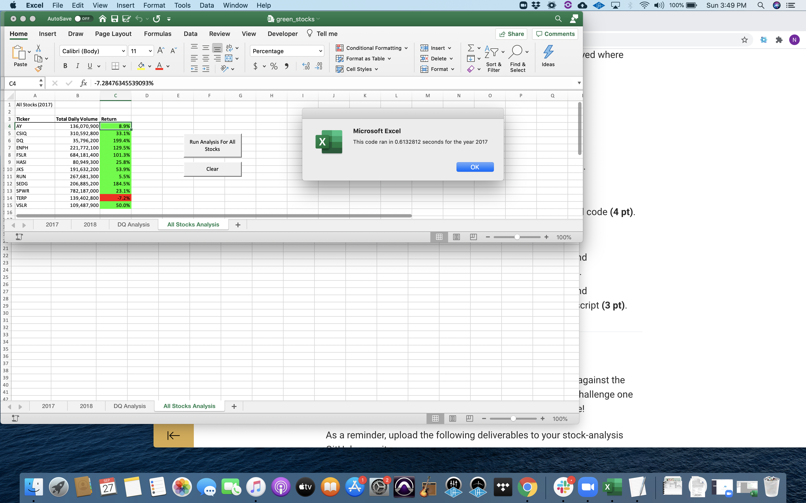

# stock-analysis

## Overview of Project

The goal of this analysis was to break down data on returns for 12 different stocks.

The initial code, while effective, was not as efficient as it could be. Therefore, we now refactored the code to cut out redundancies and make it more useful for larger blocks of stock data.

## Results

The refactored code shaved a considerable amount of time (about 80% faster)

### Original Code

### Refactored Code

## Summary
### What are the advantages or disadvantages of refactoring code?

### How do these pros and cons apply to refactoring the original VBA script?
